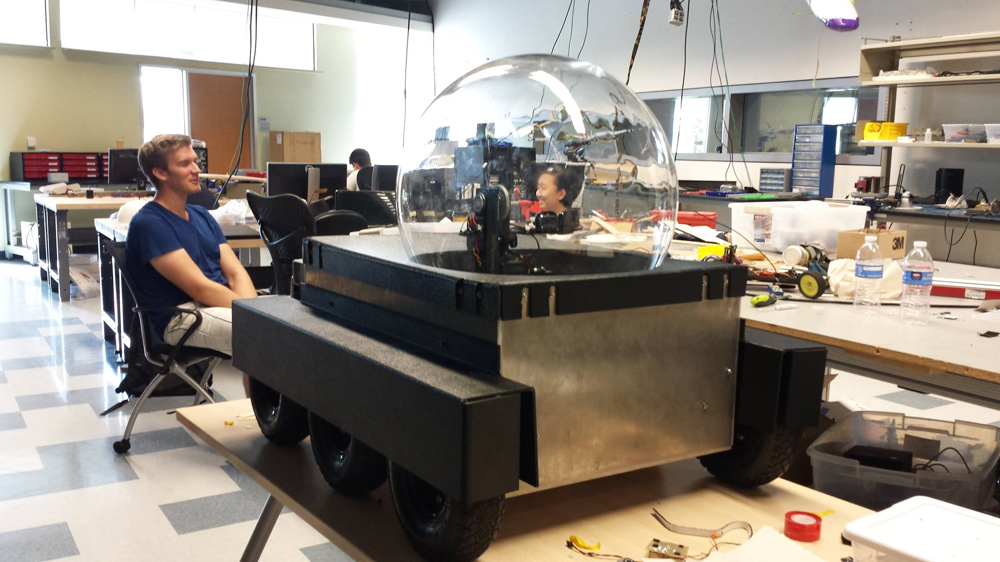

Welcome to my page!
==================
My name is Dustin and I am currently working towards my degrees in Electrical Engineering and Computer Systems Engineering.

### [Link to my Portfolio](./Portfolio/PortfolioV2.html).

### Past Projects
- [ICs made in Microwind](./IC.html)
	* 2 input NAND Gates
	* Oscillators
- [Circuit and PCB Design](./CircuitDesign.html)
	* Bare Bones Arduino

- [Engineers-4-Exploration: Wolf Tracker 2014](https://github.com/UCSD-E4E/Wolf-Tracker-2014/wiki)
    * Designed and programmed the controls system

- [Engineers-4-Exploration: Bird Collision Detection aka "Angry Birds"](https://github.com/UCSD-E4E/AngryBirds)
    * Designed the 3d Printed system enclosure
    * Programmed the image capture program triggred by bird collision

### Guides by Yours Truly

- [Snippets of C](./LearnC.html)
	* C code in snippets w/ some explanations

<!-- ### Media 
- [Mr. UAA](http://greenandgold.uaa.alaska.edu/blog/19872/student-spotlight-dustin-mendoza/)
- [Anchorage Press "Welcome Evil Geniuses"](http://www.anchoragepress.com/news/welcome-evil-geniuses)
- [2014 Summer REU](http://e4e.ucsd.edu/news-and-updates/2014-summer-reu) -->